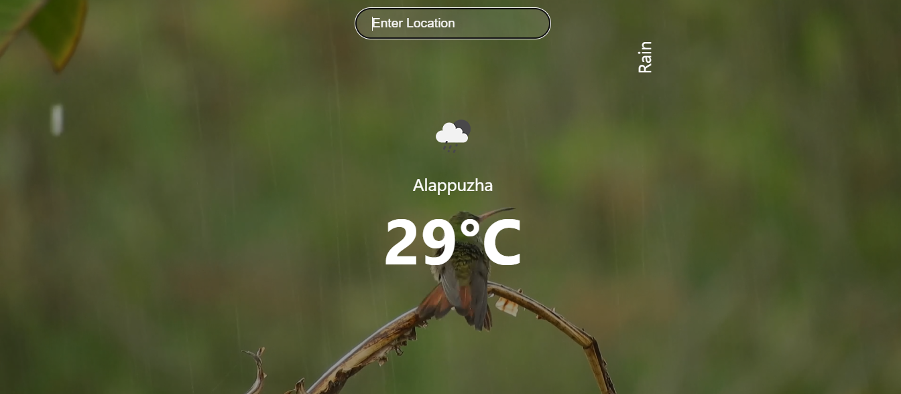

Weather App (React)
A simple React application that displays weather information using the OpenWeatherMap API.
Features

Fetches real-time weather data for a user-specified location.
Displays temperature, humidity, wind speed, and weather conditions.
Responsive design for mobile and desktop.
Stylish toggle button to switch between Celsius and Fahrenheit units.
Auto-focus on the search bar for quick location entry.
5-day weather forecast with daily summaries.
Dynamic background videos based on weather conditions.

Installation

Clone the repository:git clone https://github.com/your-username/weather-app-react.git

Navigate to the project directory:cd weather-app-react

Install dependencies:npm install

Start the development server:npm start

Usage

Open http://localhost:3000 in your browser.
The search bar is automatically focused, allowing you to type a city name and press Enter to view the weather.
Click the stylish "Switch to Fahrenheit/Celsius" button to toggle temperature units.
View the 5-day forecast below the current weather details.

Screenshot

Technologies

React
OpenWeatherMap API
CSS (with background videos for weather conditions)

Contributing
Fork the repository, make changes, and submit a pull request.
License
MIT License
