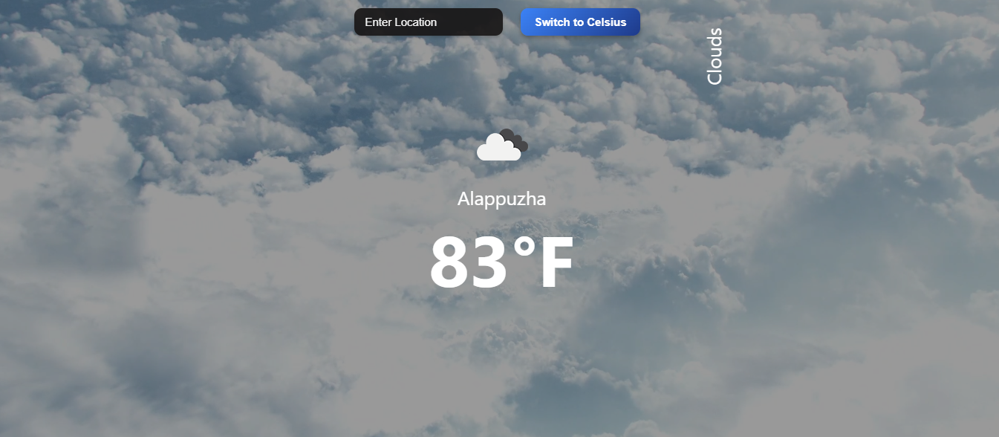

# Weather App (React)

A simple React application that displays real-time weather information using the OpenWeatherMap API. Features a responsive design, temperature unit toggle, 5-day forecast, and dynamic background videos based on weather conditions.

[](https://opensource.org/licenses/MIT)

## Table of Contents
- [Features](#features)
- [Screenshots](#screenshots)
- [Requirements](#requirements)
- [Setup](#setup)
- [Usage](#usage)
- [Project Structure](#project_structure)
- [Technologies](#technologies)
- [Contributing](#contributing)
- [License](#license)

## Features
- **Real-Time Data**: Fetches weather data for user-specified locations.
- **Weather Details**: Displays temperature, humidity, wind speed, and conditions.
- **Responsive Design**: Adapts to mobile and desktop screens.
- **Unit Toggle**: Stylish button to switch between Celsius and Fahrenheit.
- **Auto-Focus Search**: Search bar is focused on page load for quick entry.
- **5-Day Forecast**: Shows daily weather summaries.
- **Dynamic Backgrounds**: Videos change based on weather conditions.

## Screenshots
| Weather Dashboard |
|-------------------|
|  |

## Requirements
- Node.js (v16 or higher)
- npm
- Git
- Web browser (e.g., Chrome, Firefox, Edge)
- OpenWeatherMap API key (sign up at [OpenWeatherMap](https://openweathermap.org/))

## Setup
1. Clone the repository:
   ```bash
   git clone https://github.com/johnkoshy/Weather-Application-React.git
   cd Weather-Application-React
   ```
2. Install dependencies:
   ```bash
   npm install
   ```
3. Configure the OpenWeatherMap API key:
   - Create a `.env` file in the project root.
   - Add your API key:
     ```bash
     echo "REACT_APP_OPENWEATHERMAP_API_KEY=your_api_key" > .env
     ```
   - Replace `your_api_key` with your actual key from OpenWeatherMap.
4. Start the development server:
   ```bash
   npm start
   ```
   - Open `http://localhost:3000` in your browser.

## Usage
1. Access the app at `http://localhost:3000`.
2. Type a city name in the **Search Bar** (auto-focused) and press Enter.
3. View current weather details (temperature, humidity, wind speed, conditions).
4. Click the **Switch to Fahrenheit/Celsius** button to toggle units.
5. Scroll to see the **5-Day Forecast** with daily summaries.

## Project Structure
- **public/**:
  - **index.html**: Main HTML entry point.
  - **assets/**: Static assets (e.g., background videos).
- **src/**:
  - **components/**: React components (e.g., `Weather.jsx`, `Forecast.jsx`).
  - **App.jsx**: Main app component.
  - **App.css**: Global styles.
  - **index.jsx**: React entry point.
- **screenshots/**: Stores app screenshots.
- **.env**: Environment variables (e.g., API key).
- **package.json**: Project dependencies and scripts.

## Technologies
- **React**: Frontend framework.
- **OpenWeatherMap API**: Source for weather data.
- **CSS**: Styling with dynamic background videos.

## Contributing
Contributions are welcome! 🎉 Fork the repository, make changes, and submit a pull request. For issues or suggestions, open an issue on [GitHub](https://github.com/johnkoshy/Weather-Application-React/issues).

## License
This project is licensed under the [MIT License](LICENSE).